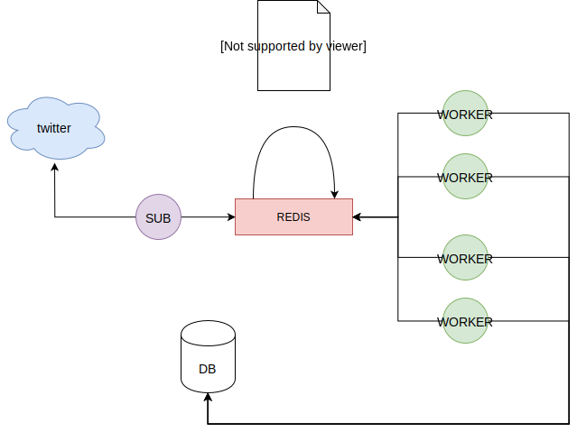

# Scrapper



## Personal Project:
Learn about:
- Celery
- Docker, Docker-Compose
- Mongodb
- Extra:
  - mailing
  - twitter API.


This project consist of a sentiment analysis about the:
- we filter the tweets and send them to 
- Stock predictions based on news.

- Number of tweets of a specific topic.
- 

GOAL:
- Create an inform every hour of the last hour.
  - DIfferent **topics**, 
    - good comments  
    - bad comments
    - total comments
    - Sum of followers of bad comments
    - Sum of followers of good comments


Install
```sh
pip install virtualenv
which python
>>> /path/to/python
virtualenv --python=/path/to/python .venv
```

Activate Enviroment
```sh
source .venv/bin/activate
```

## Run
```sh
sudo docker-compose up
sudo docker-compose up --scale worker=5 # 5 workers
```


### Manually

Terminal 1. (BROCKER)
```sh
docker run -p 6379:6379 redis # BROCKER
```

Terminal 2. (WORKER)
```
celery -A scrapper worker --loglevel=info
```

Terminal 3. (SUBMIT JOB)
```sh
python
>>> from scrapper import do_work
>>> do_work.delay(5)
<AsyncResult: c2c13c5b-dbec-43da-878e-83b6114ee944>
```
> It will appear the result in the worker log

### Bibliography
- [almost-real-time-twitter-sentiment-analysis-with-tweep-vader](https://towardsdatascience.com/almost-real-time-twitter-sentiment-analysis-with-tweep-vader-f88ed5b93b1c)
  - [Almost](https://github.com/Mjrovai/Python4DS/blob/master/Almost_Real_Time_Twitter_Sentiment_Analysis/almost_real_time_twitter_sentiment_analysis_EXT.ipynb)
- [Vander](https://medium.com/analytics-vidhya/simplifying-social-media-sentiment-analysis-using-vader-in-python-f9e6ec6fc52f)

